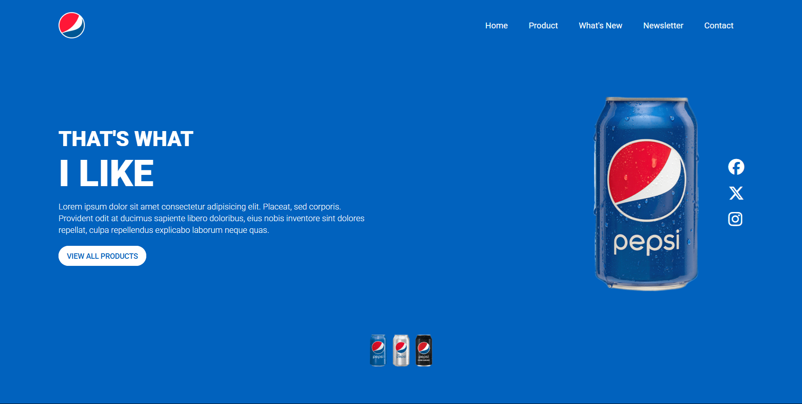

# Pepsi Landing Page 🥤

A responsive and animated landing page inspired by the Pepsi brand. Built using only **HTML** and **CSS**, this project showcases modern web design techniques with smooth animations and mobile responsiveness.

## 🚀 Features

- Clean and bold Pepsi-style layout
- CSS-only animations and transitions
- Fully responsive for mobile and desktop
- Lightweight and fast-loading
- No JavaScript used

## 🔧 Technologies Used

- HTML5
- CSS3 (Flexbox, Grid, Animations)
- Google Fonts (optional)
- Responsive design techniques

## 📸 Screenshots

